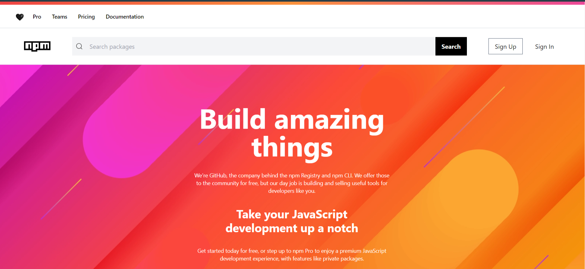
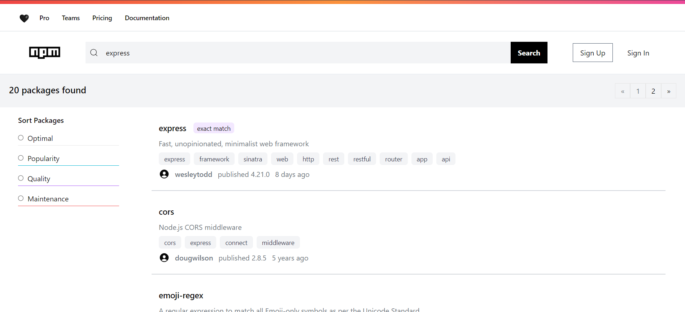
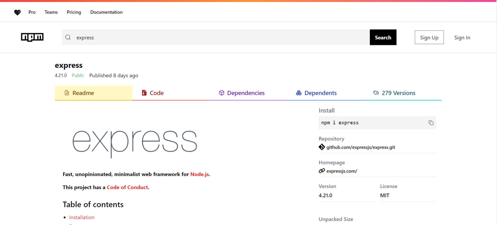

# NPM Clone Project


This is a [Next.js](https://nextjs.org/) project bootstrapped with [`create-next-app`](https://github.com/vercel/next.js/tree/canary/packages/create-next-app), aiming to clone the npmjs website functionality and design.

## 🚀 Tech Stack

- **Next.js**: React framework for building the user interface
- **Redux**: State management library
- **Shadcn**: UI component library for enhanced visual effects
- **Tailwind CSS**: Utility-first CSS framework for styling

## Getting Started

First, run the development server:

```bash
npm run dev
# or
yarn dev
# or
pnpm dev
# or
bun dev
```

Open [http://localhost:3000](http://localhost:3000) with your browser to see the result.

You can start editing the page by modifying `app/page.js`. The page auto-updates as you edit the file.

This project uses [`next/font`](https://nextjs.org/docs/basic-features/font-optimization) to automatically optimize and load Inter, a custom Google Font.

## 🌟 Key Features

- Replication of npmjs website functionality
- Responsive design for various screen sizes
- State management using Redux
- Enhanced UI components with Shadcn

## 📌 Important Notes

- Some information is missing in the API, which may result in incomplete details in certain areas of the application.
- This project is for educational purposes and not intended for production use.

## Learn More

To learn more about Next.js, take a look at the following resources:

- [Next.js Documentation](https://nextjs.org/docs) - learn about Next.js features and API.
- [Learn Next.js](https://nextjs.org/learn) - an interactive Next.js tutorial.

You can check out [the Next.js GitHub repository](https://github.com/vercel/next.js/) - your feedback and contributions are welcome!

## 📊 Project Structure

- `/pages`: Next.js pages
- `/components`: Reusable React components
- `/styles`: Global styles and Tailwind configuration
- `/store`: Redux store setup and slices
- `/public`: Static assets

## 🛠️ Configuration

- Tailwind CSS configuration can be found in `tailwind.config.js`
- Next.js configuration is in `next.config.js`

## 🤝 Contributing

Contributions, issues, and feature requests are welcome. Feel free to check [issues page](https://github.com/your-username/npm-clone-project/issues) if you want to contribute.

## Deploy on Vercel

The easiest way to deploy your Next.js app is to use the [Vercel Platform](https://vercel.com/new?utm_medium=default-template&filter=next.js&utm_source=create-next-app&utm_campaign=create-next-app-readme) from the creators of Next.js.

Check out our [Next.js deployment documentation](https://nextjs.org/docs/deployment) for more details.

## 📜 License

This project is [MIT](https://choosealicense.com/licenses/mit/) licensed.

---

## 🔑 Key Points Summary

- Clone of npmjs website built with Next.js
- Utilizes Redux for state management
- Incorporates Shadcn for UI enhancements
- Styled with Tailwind CSS
- Some API data limitations
- Easy to run with `npm run dev`
- Educational project, not for production use
- Deployable on Vercel

## Screenshot



